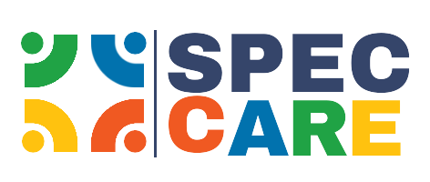

# Bayanno.ai Frontend

<div align="center">
  
  <h3>Team DU_Prometheus</h3>
  <p>A Next-generation AI-powered Document Management and Translation Platform</p>
</div>

## 🌟 Features

- **Document Management**
  - Public and private document storage
  - PDF viewing and management
  - Tag-based organization
  - Smart search functionality

- **AI-Powered Translation**
  - Real-time document translation
  - Multiple language support
  - Context-aware translations

- **Story Vision**
  - AI-generated story visualization
  - Audio to story conversion
  - Interactive story experiences

- **Smart Chat**
  - AI-powered chat interface
  - Document-based conversations
  - Context-aware responses

- **User Management**
  - Secure authentication
  - Profile customization
  - Public/Private document sharing
  - Real-time notifications

## 🚀 Tech Stack

- **Framework**: Next.js 13+ (App Router)
- **Styling**: Tailwind CSS
- **UI Components**: Radix UI
- **State Management**: React Hooks
- **Authentication**: JWT
- **API Integration**: Custom Fetch Hooks

## 💻 Getting Started

1. **Clone the repository**
   ```bash
   git clone [repository-url]
   cd frontend
   ```

2. **Install dependencies**
   ```bash
   npm install
   # or
   yarn install
   ```

3. **Environment Setup**
   Create a `.env.local` file in the root directory:
   ```env
   NEXT_PUBLIC_ENDPOINT=http://localhost:8000
   ```

4. **Run the development server**
   ```bash
   npm run dev
   # or
   yarn dev
   ```

5. **Open your browser**
   Navigate to [http://localhost:3000](http://localhost:3000)

## 🏗️ Project Structure

```
frontend/
├── app/                    # Next.js 13 app directory
│   ├── chat/              # Chat feature pages
│   ├── documents/         # Document management
│   ├── profile/          # User profiles
│   └── translate/        # Translation feature
├── components/           # Reusable components
│   ├── ui/              # UI components
│   └── utils/           # Utility components
├── lib/                 # Utility functions
├── public/              # Static assets
└── styles/             # Global styles
```

## 🤝 Contributing

1. Fork the repository
2. Create your feature branch (`git checkout -b feature/AmazingFeature`)
3. Commit your changes (`git commit -m 'Add some AmazingFeature'`)
4. Push to the branch (`git push origin feature/AmazingFeature`)
5. Open a Pull Request

## 👥 Team DU_Prometheus

Our dedicated team of developers from the University of Dhaka:
- **Fahim Shakil** - Frontend Developer
- **Dipto Shaha** - Frontend Developer
- **Abdullah Al Mahmud** - Backend Developer


## 📄 License

This project is licensed under the MIT License - see the [LICENSE](LICENSE) file for details.

## 🙏 Acknowledgments

- Special thanks to our mentors and advisors
- University of Dhaka CSE Department
- All contributors and supporters of the project

----